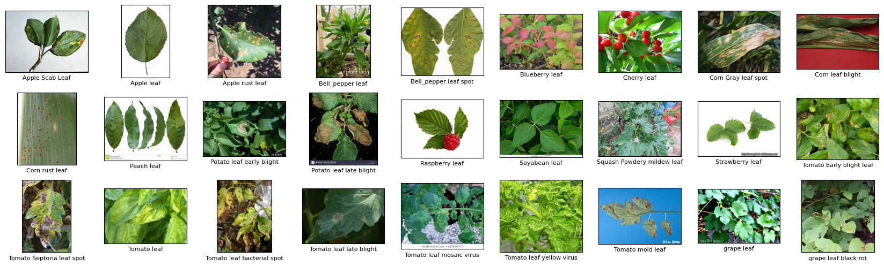
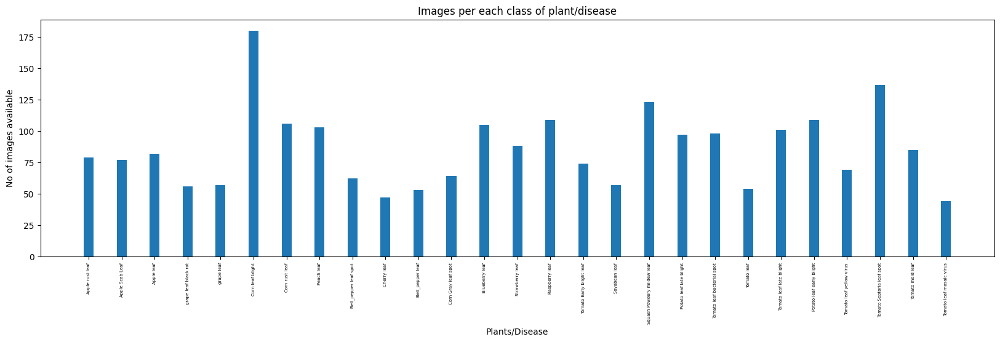

# Leaf Classification Resnet

📁 Created by: Elsa Nurul Hidayah, 2024

This repository is created to fulfill the bootcamp Computer Vision final project requirement from Indonesia AI.

🔬 This project is aimed at empowering farmers with a rapid and reliable tool for crop assessment. Therefore, the urgency of implementing such a solution is evident in its potential to transform agricultural practices, ensuring a more resilient and productive future for global food production.

## Problem Statement & Objectives

Traffic congestion is a major issue in urban areas, leading to increased travel times, pollution, and accidents. The goal of TrafficNet is to utilize advanced computer vision techniques, particularly image segmentation, to analyze and understand roads and obstacles in real-time. The ultimate objective is to contribute to the development of self-driving cars powered by artificial intelligence, capable of efficiently navigating through congested city streets.


The objectives of this agricultural solution theough the classification of leaves include:

1. Early Detection: Enable farmers to identify plant health issues at their early stages, facilitating timely intervention.

2. Resource Optimization & Cost-Effectiveness: Contribute to efficient resource management by aiding farmers in optimizing inputs such as water, fertilizers, and pesticides, which in turn saves farmers from spending unnecessary treatments and interventions.

3. Global Food Security: Contribute to global food security by improving crop productivity and minimizing losses in the face of increasing demands and changing environmental conditions.

## Dataset

This dataset was about a condition that india recently had because they experience loses 35% of the annual crop yield due to plant disease. This dataset provides some information about the condition of healthy and diseased leaf. 
- This dataset was divided into 2 partition Train and Test
- Every partition has 27 classes that represent every leaf conditions.
- Every class DO NOT HAVE same number of images.




## Model Architecture

After we did cleanse our data and add transformation process such as augmentation, next we put our data into model to train our system to identify which images belongs to 1 of 27 leaf class.

## Results 


### Streamlit Implementation
https://plant-disease-detection-indonesiaai.streamlit.app/


## Implementation Details

The project is implemented in PyTorch and makes use of the segmentation_models_pytorch library. The model is trained on a GPU if available; otherwise, it falls back to CPU. To run this project on your local machine using Google Colab connected to Google Drive, follow these systematic steps:

### Prerequisites

Before you begin, make sure you have the following prerequisites:

1. Google Colab account
2. Access to Google Drive
3. Dependencies (in the section below)

### Procedure

1. Open Google Colab and navigate to the notebook located in the project's directory.

2. Mount Google Drive within the Colab notebook by executing the following cell:

    ```python
    from google.colab import drive
    drive.mount('/content/drive')
    ```
3. Clone the repository to your google colab (recommended):

    ```bash
   git clone https://github.com/elsxnh/Leaf-Classification-Resnet.git
    ```
